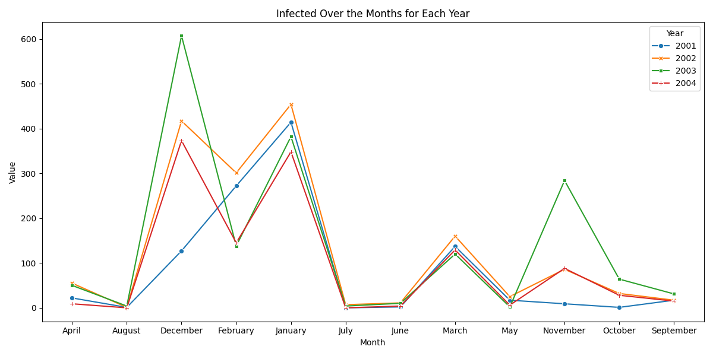

# Laboratory of Mathematical Modelling
## Network Modelling and Simulations

Project for the course of *Laboratory Mathematical Modelling* held by Professor Marchetti (A.Y. 2023-2024) for the master curse Quantitative and Computational Biology (QCB) at university of Trento, italy.

This is based on the article:

[Stochastic modeling of the transmission of respiratory syncytial virus (RSV) in the region of Valencia, Spain](https://www.sciencedirect.com/science/article/pii/S0303264709000203?casa_token=Pi9KdN2YkoQAAAAA:jB6MoDOZAnZNUfSoHWAzwBoF-XUl3OAGnPCNjJ-x2cIdxCE750DwghZy5-OcctGZ0jaxo7iIiA)

- *Arenas, A. J., González-Parra, G., & Moraño, J. A. (2009). Stochastic modeling of the transmission of respiratory syncytial virus (RSV) in the region of Valencia, Spain. Biosystems, 96(3), 206-212.*

## Authors

- [Thomas Sirchi](https://github.com/Thokas99)
- [Chiara Rosati](https://github.com/ChiaraRosati)
- [Nicola Perotti](https://github.com/nicolaperotti)

## Description
This project includes two implementations of compartmental models starting from the real data presented in the article cited above.


<div align="center">
  
</div>


The first implementation is a deterministic SIR (Susceptible-Infectious-Recovered) model, which simulates the spread of an infectious disease over time using a system of ordinary differential equations (ODEs):
```math
\beta(t) = b_{0}(1 + b_{1}\cos(2\pi t + \Phi))\\
```
```math
\begin{align*}
\dot{S}(t) &= \mu - \mu S(t) - \beta(t) S(t) I(t) + \gamma R(t), \quad S(0)=S_{0} > 0 \\
\dot{I}(t) &= \beta(t) S(t) I(t) - \nu I(t) - \mu I(t), \quad I(0)=I_{0} > 0 \\
\dot{R}(t) &= \nu I(t) - \mu R(t) - \gamma R(t), \quad R(0)=R_{0} > 0\\
\end{align*}
```


<div align="center">
  
</div>


The second implementation introduces a stochastic element by utilizing the Euler-Maruyama method to simulate a stochastic differential equation (SDE) model. This extended model also represents the spread of an infectious disease within the SIR framework, incorporating stochastic perturbations in the transmission rate and birth rate.

<div align="center">
  
</div>

## Libraries Used
- [NumPy](https://numpy.org/) A powerful library for numerical computing in Python.
- [SciPy](https://scipy.org/): A library for scientific computing that includes modules for numerical integration (Solve_ivp is used from scipy.integrate for solving ODEs).
- [Matplotlib](https://matplotlib.org/): A plotting library for creating visualizations in Python.
- [Questionary](https://github.com/tmbo/questionary): a library that allows better user imput data


