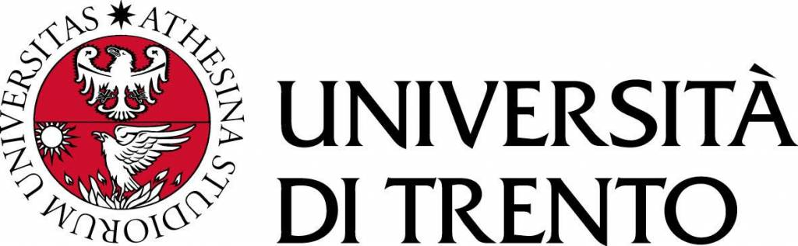

# Laboratory of Mathematical Modelling

Project for the course of *Laboratory Mathematical Modelling* held by Professor Marchetti (A.Y. 2023-2024) at university of Trento, italy.

## Authors

- Thomas Sirchi [Thokas99](https://github.com/Thokas99)
- Chiara [ChiaraRosati](https://github.com/ChiaraRosati)
- Nicola [nicolaperotti](https://github.com/nicolaperotti)

## Description
This project includes two implementations of compartmental models. The first one is a deterministic SIR (Susceptible-Infectious-Recovered) model, which simulates the spread of an infectious disease over time using a system of ordinary differential equations (ODEs). 

The second implementation introduces a stochastic element by utilizing the Euler-Maruyama method to simulate a stochastic differential equation (SDE) model. This extended model also represents the spread of an infectious disease within the SIR framework, incorporating stochastic perturbations in the transmission rate and birth rate.

.png)

## Libraries Used
- *NumPy*: A powerful library for numerical computing in Python.
- *SciPy*: A library for scientific computing that includes modules for numerical integration (odeint is used from scipy.integrate for solving ODEs).
- *Matplotlib*: A plotting library for creating visualizations in Python.
- *Questionary*: a library that allows better user imput data

{:width="100px"}
